```{r setup, include=FALSE}
options(htmltools.dir.version = FALSE, crayon.enabled = TRUE)
knitr::opts_chunk$set(cache = TRUE,
                      fig.align='center',
                      message = FALSE,
                      warning = TRUE)

# install.packages("devtools")
# devtools::install_github("gadenbuie/countdown")
# devtools::install_github("mitchelloharawild/icons")
library(countdown)
library(icons)
#download_fontawesome()
```


## Objectifs 

### Éléments théoriques
- Initiation au literate programming avec R Markdown. 
- Bonnes pratiques en matière de reproductibilité et documentation de méthodes. 
- Fournir des ressources de référence pour approfondir l'apprentissage. 
- *DoItYourSelf* / *Self gratification*. 


<br>

### Déroulé

.pull-left[

[Partie 1 - Literate programming ?](#part1)

[Partie 2. Initier un projet R Markdown avec RStudio](#part2)

[Partie 3. La syntaxe Markdown](#part3)
]   

.pull-right[

[Partie 4. Bonnes pratiques (code)](#part4)

[Partie 5. Jouer du code dans du R Markdown](#part5)

[Conclusion. Saint-Pierre d'Oléron, un bon choix ?](#part6)
   
]

---

## L'atelier - 2 possibilités en fonction de votre niveau de pratique de R

.pull-left[
### Débutant
Mobiliser un jeu de données disponible avec R (cars).

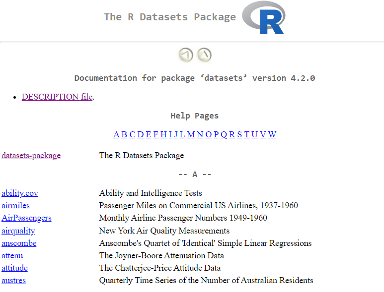

]

.pull-right[
### Confirmé
Caractériser l'environnement géographique des centres de vacances CNRS
```{r, echo = FALSE, message = FALSE, warning = FALSE, fig.height = 5, fig.width= 7}
library(sf) # Manipulation de données spatiales
library(mapsf) # Représentations cartographiques

# Géolocalisation des centres
cent <- read.csv(file = "data/cnrs.csv")
cnrs <- st_as_sf(cent, coords = c("longitude", "latitude"), crs = 4326)
cnrs <- st_transform(cnrs, 2154)

# France
fr <- st_read(dsn = "data/fr.gpkg", layer = "fr", quiet = TRUE)

# Et cartographie
par(mar = c(0,0,0,0))
mf_theme("nevermind")
mf_map(fr, border = NA)
mf_map(cnrs, bg = "red", pch = 21, cex = 2, add = T) 

mf_label(x = cnrs, var = "lieu", halo = TRUE, pos = 1,
         overlap = FALSE, lines = FALSE, bg = "white", cex = 1)

mf_layout(title = "Les villages du CNRS",
          credits = "Ecole Thématique SIG-R, RIATE, 2021", arrow = FALSE)
```
]


---

## L'atelier - 2 possibilités en fonction de votre niveau de pratique de R

.pull-left[
### Débutant
Mobiliser un jeu de données disponible avec R (cars).

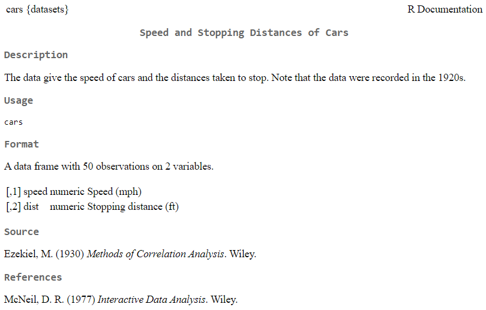

]

.pull-right[
### Confirmé
3 représentations cartographiques possibles (population, pollution lumineuse, équipements touristiques à proximité)
```{r, echo = FALSE, message = FALSE, warning = FALSE, fig.height = 5, fig.width= 7}
# Import libraries
library(sf)
library(mapsf)

# Data import
com <- st_read(dsn = paste0("data/oleron.gpkg"), layer = "com", quiet = TRUE)
buf <- st_read(dsn = paste0("data/oleron.gpkg"), layer = "cnrsBuf", quiet = TRUE)

# Cartography - Municipal population
mf_map(buf, col = "lightblue", border = NA) # Analysis perimeter
mf_map(com, col = "white", add = TRUE) # Display muncipalities
mf_map(com, type = "prop", var = "POP_2019", leg_pos = "topleft", col = "grey34",
       border = "white", leg_title = "Population 2019") # Map
mf_map(buf, col = NA, lwd = 2, add = TRUE) # Analysis perimeter contour

# Order higher values and display them
com <- com[order(com$POP_2019, decreasing = TRUE),]
mf_label(x = com[1:5,], var = "LAU_NAME", halo = TRUE, overlap = FALSE, 
         lines = FALSE, bg = "white") # Label des 5 communes les plus peuplées 

# Map layout
mf_layout(title = paste0(round(sum(com$POP_2019),-2),
                         " habitants dans les bourgs des environs"),
          credits = paste0("Ecole Thématique SIG-R, RIATE, 2021\n",
                           "Source : Eurostat - GISCO, 2021"), arrow = FALSE)
```
]

---
name: part1
class: inverse, center, middle

# Partie 1 - Literate programming ? 

---

## Literate programming ? 

**Paradigme de programmation** qui consiste à associer ensemble du code source (pour les ordinateurs) à de la documentation (pour les humains).</p>

- Un processus d'explication de la pensée : *Expliquer à des êtres humains ce que nous voulons que l'ordinateur fasse* ([Knuth, 1970](https://www-cs-faculty.stanford.edu/~knuth/lp.html)).
- Des programmes qui gagnent en qualité : une explication ininterrompue de la logique, à la manière d'un essai.
- Rend les mauvaises décisions de conception plus évidentes (détails souvent omis dans le code source).
- Permet de reprendre des analyses ultérieurement sans se perdre, même longtemps après.
- Orienté vers la transmission et le partage de connaissance (tutoriels, manuels).  

Un gain général en **reproductibilité** de la démarche et en **ouverture** des méthodes scientifiques.


---

## Literate programming ? 

.pull-left-c[
Associe un langage de programmation à un langage de balisage léger, dans un environnement de développement ou un document.  

Premier environnement de literate programming : WEB (1981), combinaison de Pascal et TeX.  

Une application sur l'analyse des nombres premiers.  
]

.pull-right-c[
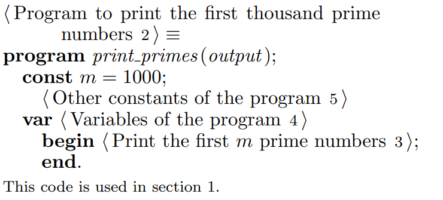

.leg-fig[
Présentation du système de documentation *WEB* par [Donald E. Knuth, Computer Journal (1984)](http://literateprogramming.com/knuthweb.pdf)
]

]


---

## Plusieurs solutions existent


| Nom                  | Langage supporté      | Langage de balisage                             | Date de création |
|----------------------|-----------------------|---------------------------------------------------|------------------|
| [WEB](http://infolab.stanford.edu/pub/cstr/reports/cs/tr/83/980/CS-TR-83-980.pdf)                  | Pascal                | TeX                                               | 1981             |
| [CWEB](http://tug.ctan.org/info/knuth/cwebman.pdf)                 | C et C++              | TeX, LaTeX                                                | 1987             |
| [Sweave](https://rpubs.com/YaRrr/SweaveIntro)               | R                     | PDF                                               | 2002             |
| [Knitr](https://github.com/yihui/knitr/releases/download/doc/knitr-manual.pdf)                | R                     | LaTeX, PDF, LyX, HTML, Markdown, AsciiDoc,        | 2012             |
| [R Markdown](https://rmarkdown.rstudio.com/)           | R, Python, Julia, SQL | Markdown                                          | 2014             |
| [Jupiter Notebook](https://jupyter-notebook.readthedocs.io/en/stable/)     | Python (kernel de défaut)      | Markdown                                          | 2014             |
| [Observable](https://observablehq.com/@observablehq/how-observable-runs?collection=@observablehq/overview)           | JavaScript (librairie D3)  | Markdown / LaTeX                                         | 2018             |

--

Leur usage dépend...
.pull-left-c[
- Du langage de programmation supporté. 
- De l'usage de la communauté. 
- De la variété des formats de sortie proposés.
]

.pull-right-c[
- Des évolutions technologiques. 
- De l'intégration dans un environnement de développement intégré (IDE).
]

---

## R Markdown

.pull-left-c[
Format de document initié en 2012 par **Yihui Xie** avec [knitr](https://github.com/yihui/knitr/releases/download/doc/knitr-manual.pdf) puis étendu dans le package [rmarkdown](https://cran.r-project.org/web/packages/rmarkdown/index.html) en 2014. Fait aujourd'hui référence dans l'écosystème de R. 

Plusieurs objectifs :

- Compiler des documents R Markdown dans différents formats de sortie : PDF, HTML, Word.
- Pouvoir jouer du code R dans la documentation.
- Produire des sorties interactives (dahshboards) et des sorties de document "attractives". 
- Produire facilement des manuels, sites Web. 

]

.pull-right-c[


.leg-fig[
Présentations de *Yihui Xie* sur [R Markdown](https://vimeo.com/94181521) et ses [origines](http://datascience.la/yihui-xie-the-user-2014-interview/)
]

]


---

## R Markdown

`rmarkdown` repose sur une **large communauté d'utilisateurs et de développeurs** :
- En évolution constante (Yihui Xie est développeur logiciel à RStudio).
- Très bien documenté, des exemples clé en main, des modèles de mise en page (*templates*)
- Recours important à `rmarkdown` par d'autres packages R. 

```{r, echo= FALSE, message=FALSE}
library(tools)
library(dplyr)
library(stringr)
library(purrr)
library(cranlogs)
library(kableExtra)

pdb <- tools:::CRAN_package_db() 

# Package and indicators of interest
pack <- c("rmarkdown", "knitr", "bookdown", "rticles", "blogdown", "xaringan")
meta_data <- pdb[, c(1,2, 46, 5, 17, 60, 61, 63)]
meta_data <- meta_data[meta_data$Package %in% pack,]
names(meta_data) <- c("Package","Version", "Mainainer", "Import", "AutNB", "RevDepends", "RevImports", "RevSuggest")

# CLEAN THE AUTHOR'S FIELD
# Function to remove all text between two brackets
clean <- function(x){
  gsub("\\[[^]]*]", "",x)
}

# Function to remove line breaks
clean2 <- function(x){
  gsub("[\r\n]", "", x)
}

# Clean Author's field
meta_data$AutNB <- meta_data$AutNB %>% map(clean) %>% map(clean2)

rm_na <- function(x){
  list(na.omit(unlist(x)))
}

# Process the fields (aggregate number)
c_dat1 <- seq_len(nrow(meta_data)) %>%
  map_df(~{
    meta_data[.x, ] %>%
      select(-Package,-Version,-Mainainer) %>%
      map_df(~ifelse(is.na(.x), 0, length(str_split(.x, ",")[[1]]))) %>%
      mutate(Package = meta_data$Package[.x])
  }) %>%
  select(Package,Import, AutNB, RevDepends, RevImports,RevSuggest)

# Exctract info
c_dat2 <- meta_data[,c(1:3)]

# Downloads
c_dat3 <- cran_downloads(packages = pack, from = "2015-01-01", to = Sys.Date())
c_dat3 <- aggregate(c_dat3[,"count"],
                  by = list(Down = c_dat3$package), 
                  FUN = sum)

# Output results
output <- cbind(c_dat2, c_dat1[,-1], c_dat3[,-1])
colnames(output)[9] <- "Down"
output <- output[match(pack, output$Package),]

output %>%
  kable("html", row.names = FALSE) %>%
  kable_styling(font_size = 16)
```


.leg-fig[
**Statistiques liées aux packages de l'environnement R Markdown** (*Import* : packages importés au chargement, *AutNB* : nombre d'auteurs, *RevDepends* : autres packages qui dépendent du package, *RevImports* : autres packages qui importent des fonctions du package, *RevSuggest* : autres packages qui suggèrent l'usage du package, *Down* : téléchargements depuis le 1er janvier 2015)
]


---

## Repose sur...

.pull-left-c[
-  **[Markdown](https://www.markdownguide.org/getting-started/)**, un langage de balisage léger reconnu pour sa simplicité (John Gruber et Aaron Swartz, 2004)

- **R Markdown** : une variation du markdown spécifique à R et qui permet d'incorporer du code et de l'exécuter dans des *chunks*. C'est aussi un package. 

- **knitr** : un package qui interprète le code (R/Python/Julia) contenu dans les chunks *chunks* ([Yihui Xie](https://github.com/yihui/knitr/releases/download/doc/knitr-manual.pdf))

- **Pandoc** : Un logiciel qui convertit le markdown (faiblement structuré) en langage balisé (fortement structuré). Installé automatiquement avec RStudio. 

]

.pull-right-c[


.leg-fig[
[Source : FinistR2018](https://stateofther.github.io/finistR2018/atelier3_advancedrmd.html)
]
]

---

## Un document R Markdown type

Un fichier R Markdown contient 3 parties essentielles. 

.pull-left.c[

- Des **métadonnées** associées au document (YAML) : configuration des fichers de sotire (format, css, bibliographie, métadonnées auteur, date de création, etc.) 
- Du **texte**, qui décrit le cheminement de pensée : langage Markdown.
- Des **blocs de code** structurés, pour rendre reproductible l'analyse. 

Ces trois éléments sont paramétrables pour produire des documents uniques. 

]


.pull-right-c[

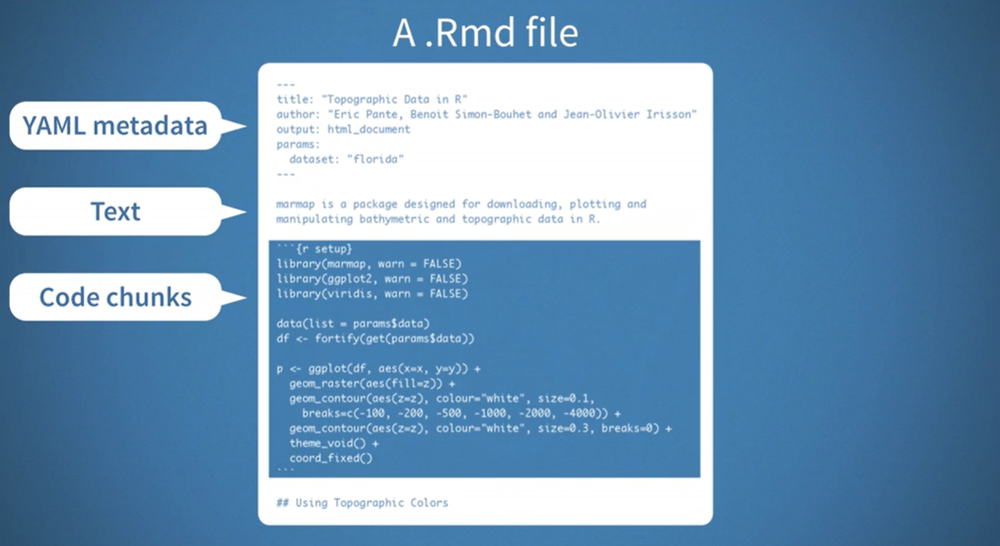
[Source : RStudio](https://rmarkdown.rstudio.com/lesson-1.html)

]


---

## Des possibilités de sorties mutliples


.fig[
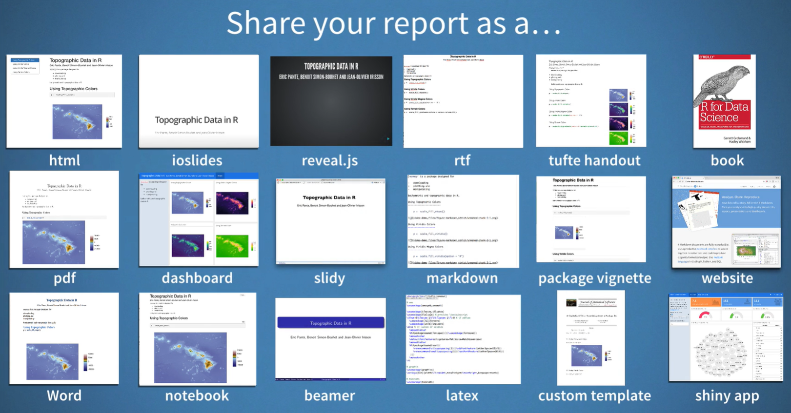
]

.leg-fig[
[Source : RStudio](https://rmarkdown.rstudio.com/lesson-1.html)
]


---

## Document R Markdown

Le modèle de document R Mardown standard de R Studio. 

.pull-left-c[
<p align="left">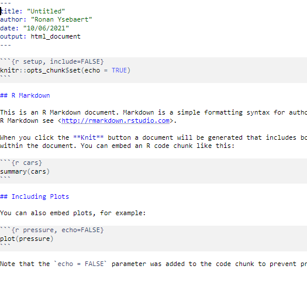</p>

]
.pull-right-c[
<p align="right">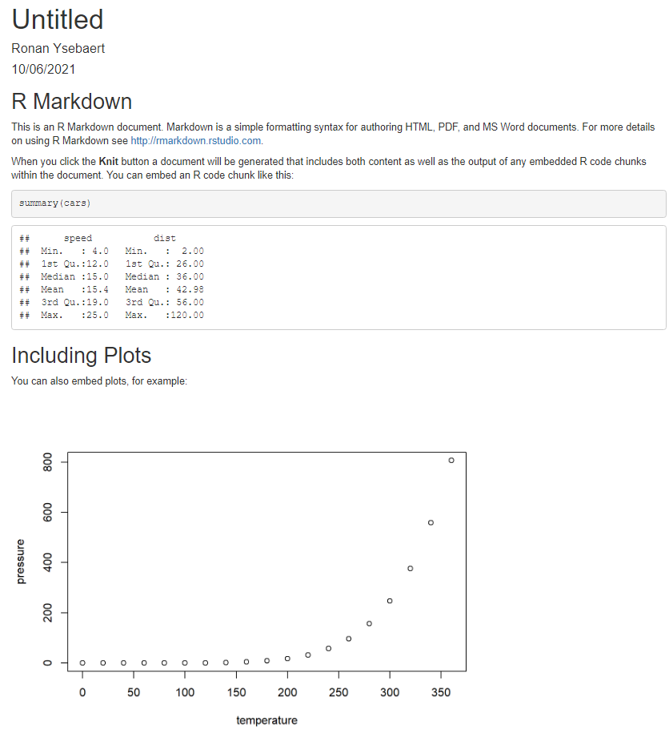</p>
]

---

## Présentations

Le modèle de présentation R Mardown standard de R Studio ([`ioslides_presentation`](https://bookdown.org/yihui/rmarkdown/ioslides-presentation.html)). 

.pull-left-c[
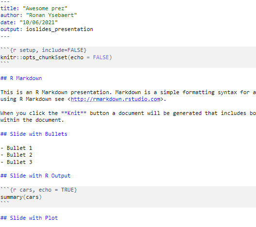
]
.pull-right-c[
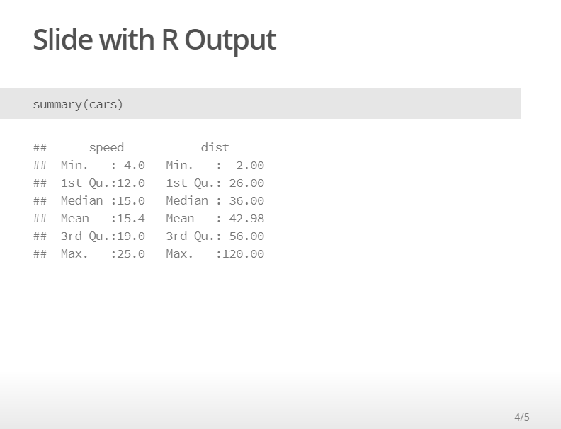
]

---

## Présentations

Des packages dédiés à la réalisation de présentations, comme [`xaringan`](https://bookdown.org/yihui/rmarkdown/xaringan.html) ou [`revealjs`](https://github.com/rstudio/revealjs) 

.pull-left-c[
.fig[
<p align="center"></p>
]
.leg-fig[
[Présentation xaringan, Xie, 2021](https://slides.yihui.org/xaringan/#1)
]
]

.pull-right-c[
.fig[
<p align="center"></p>
]
.leg-fig[
[Create Stunning Presentations on the Web](https://revealjs.com/)
]
]


---

## Bookdown

Un [package](https://bookdown.org/yihui/rmarkdown/books.html) dédié à l'écriture de rapports et livres numériques longs. Repose sur la compilation de documents R Mardown.

.pull-left-c[
<p align="center">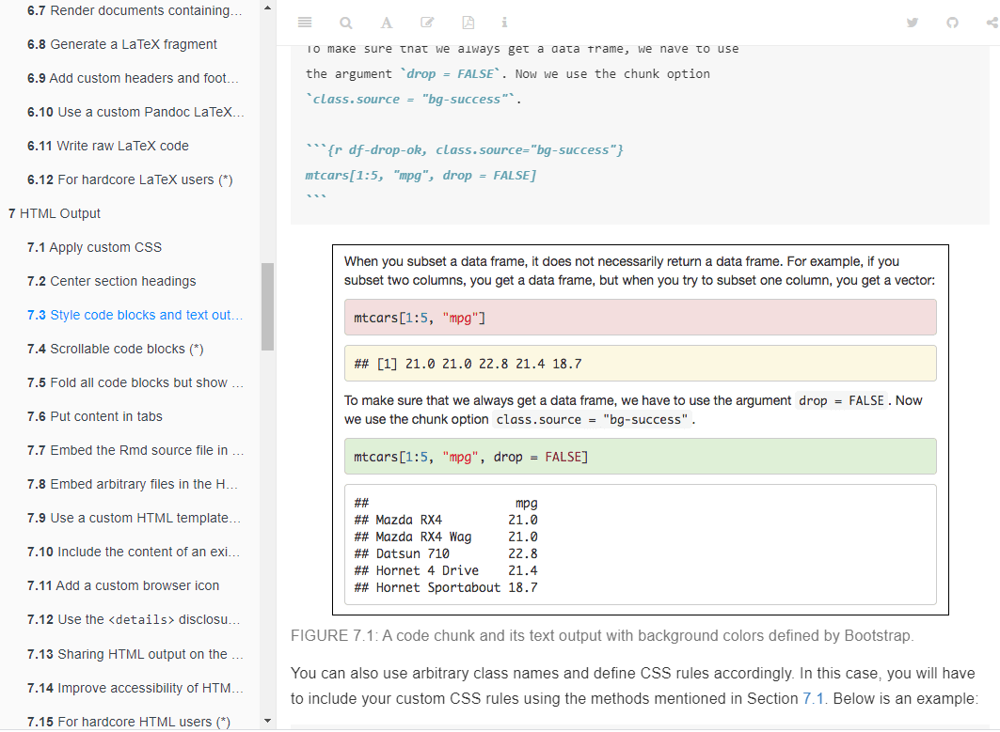</p>
]

.pull-right-c[
<p align="center"></p>
]

.leg-fig[
[RMarkdown Cookbook (Xie, Dervieux, Riederer, 2021)](https://bookdown.org/yihui/rmarkdown-cookbook/)
]


---

## Bookdown

Un [package](https://bookdown.org/yihui/rmarkdown/books.html) dédié à l'écriture de rapports et livres numériques longs. Repose sur la compilation de documents R Mardown.

.pull-left-c[
<p align="center">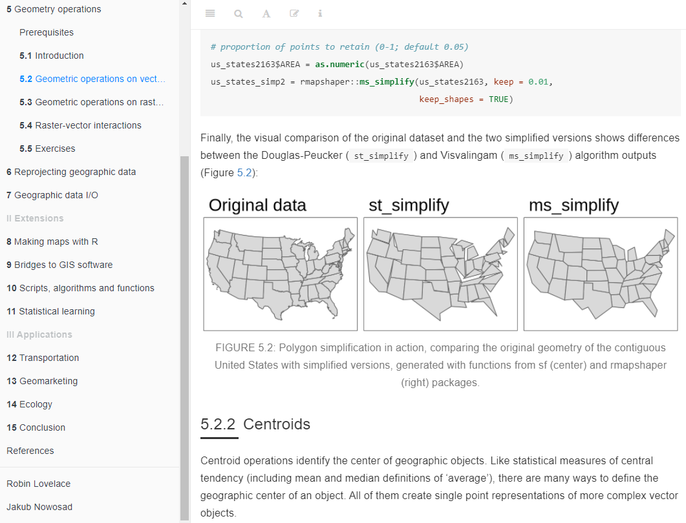</p>
]

.pull-right-c[
<p align="center"></p>
]

.leg-fig[
[Geocomputation with R (Lovelace, Nowosad, Muenchow, 2019)](https://bookdown.org/yihui/rmarkdown-cookbook/)
]

---

## Rmardown's site generator

.pull-left-c[
<p align="center">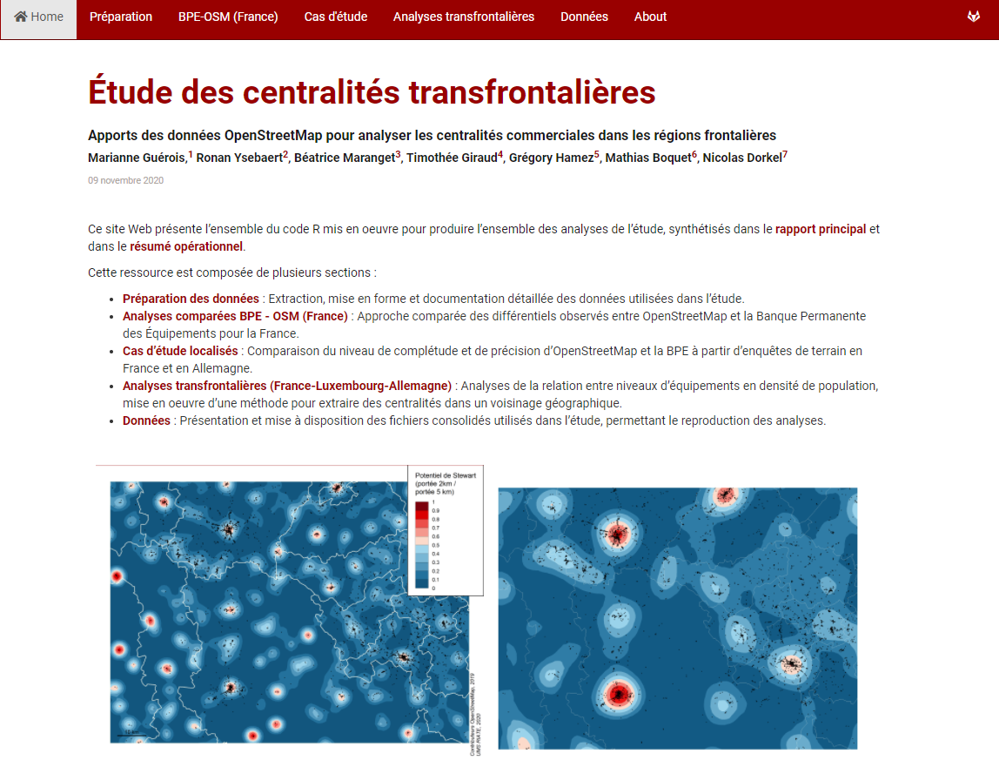</p>
]

.pull-right-c[
Transformer une collection de documents [R Markdown en site Web](https://bookdown.org/yihui/rmarkdown/rmarkdown-site.html). Chaque .Rmd devient une page du site Web.

La configuration de l'affichage de la collection de fichiers HTML s'effectue dans un fichier `_site.yml`. 

<br><br><br><br><br><br>

.leg-fig[
Un [site Web](https://rcarto.gitpages.huma-num.fr/centralite/) d'un projet de recherche qui combine préparation des données, analyses et documentations (métadonnées).
]
]

---

## Blogdown

.pull-left-c[
<p align="center"></p>
]

.pull-right-c[
Un [package](https://github.com/rstudio/blogdown) dédié à la génération de site Webs :

- Utilise par défaut un générateur de sites Web open source, [Hugo](https://gohugo.io/), qui propose de nombreux [thèmes](https://themes.gohugo.io/). 
- Possibilité d'organiser le contenu du site Web en sous-répertoires. 

<br><br><br><br>
.leg-fig[
[Rzine](https://rzine.fr/collection/#publi_rzine), un site Web dédié au partage de ressources sur la pratique de R en sciences sociales. 
]
]

---

## Journals

Le package [rticles](https://github.com/rstudio/rticles) intègre les modèles éditoriaux de plusieurs revues (sortie Rmd, pdf, TeX document). Recquiert l'installation d'outils permettant de compiler du LaTex, comme [TinyTex](https://yihui.org/tinytex/r/). Nécessite possiblement l'installation de packages [LaTex](https://bookdown.org/yihui/rmarkdown-cookbook/install-latex-pkgs.html) manquants (quelques [tips](https://github.com/yihui/tinytex/issues/210)). 

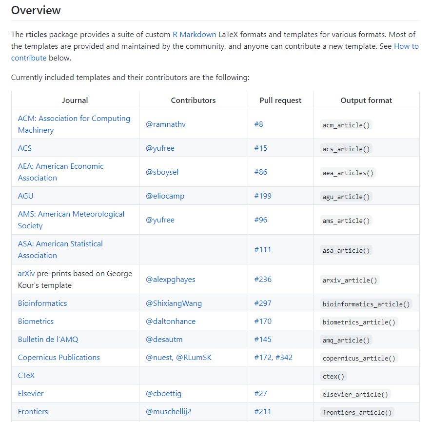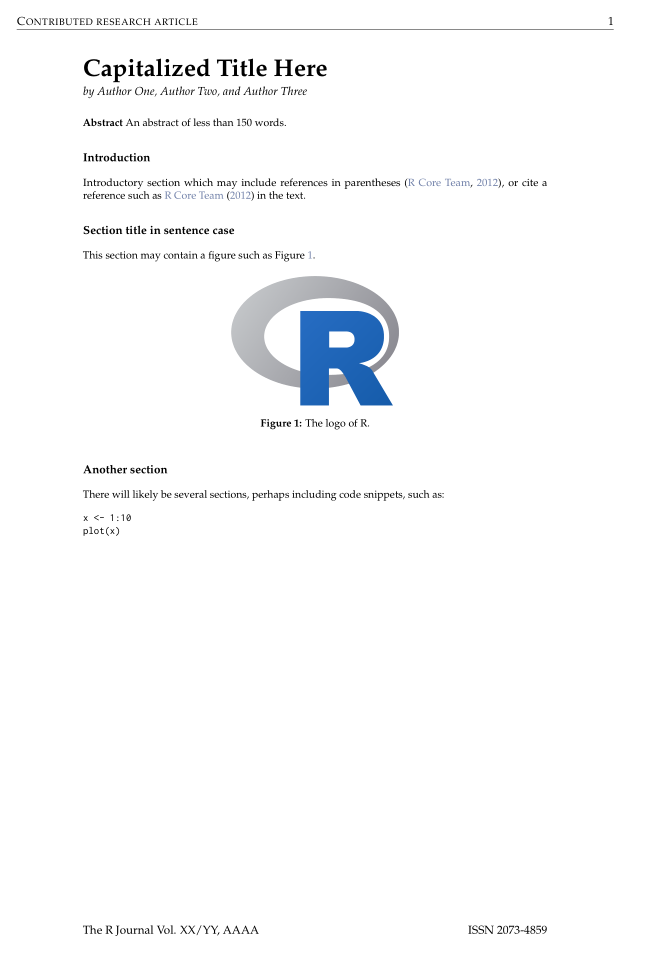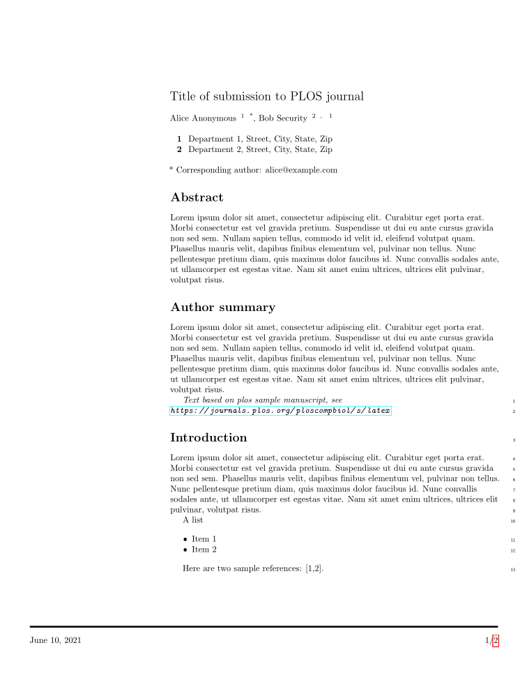

.leg-fig[
Une trentaine de revues et éditeurs référencés, dont [The R Journal](https://journal.r-project.org/) et [PLOS](https://plos.org/#journals). Ouvert aux contributions
]

---
name: part2
class: inverse, center, middle

# Partie 2 - Créer un projet R Markdown avec RStudio 

---

## Préparer son espace de travail

RStudio propose d'**organiser son travail en projet** (File > New Project). L’idée principale est de **rassembler tous les fichiers d'un même projet dans un répertoire dédié**.

<p align="center">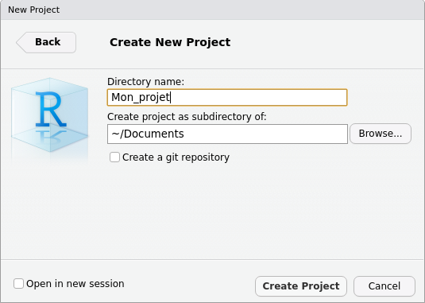</p>

- Facilite le travail discontinu
- Améliore la portabilité de son travail
- Garantie la reproductibilité de son travail


---

## Préparer son espace de travail

A l'ouverture d'un projet :

- **Le répertoire du projet est considéré par défaut comme le répertoire de travail**
- Rstudio **restaure à l'identique l'état de la session** lors de sa dernière clôture (option)
- L’historique des commandes saisies lors des précédentes séances de travail est disponible

<br>

.pull-left-c[
**Organiser son espace de travail** 
- Un R Project à la racine.
- Un dossier dédié au stockage des données.
- Un dossier qui contient les figures.
]

.pull-right-c[
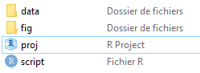</img>
]


---

## Initier un projet R Markdown dans RStudio

RStudio propose l'import de modèles [R Markdown](https://rmarkdown.rstudio.com/) (File > New File > R Markdown).


<p align="center">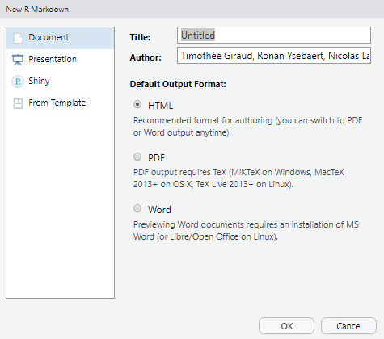</p>

---

## Modèles additionnels

Une multitude ! Avec les packages [`rmdformats`](https://github.com/juba/rmdformats), [`prettydoc`](https://prettydoc.statr.me/themes.html) et [`tufte`](https://github.com/rstudio/tufte) (documents HTML), [`xaringan`](https://github.com/yihui/xaringan) et [`revealjs`](https://github.com/hakimel/reveal.js/) (présentations), [`rticles`](https://github.com/rstudio/rticles)(revues scientifiques), [`pagedown`](https://github.com/rstudio/pagedown) (posters, pages illustrées), [`flexdashboard`](https://pkgs.rstudio.com/flexdashboard/) et [`learnr`](https://rstudio.github.io/learnr/) (dashboards, tutoriels)... 

<p align="center">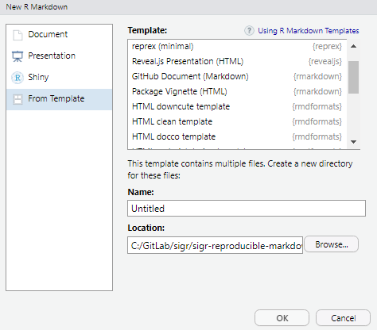</p>


---
## Des modèles paramétrables 

Possibilité d'ajouter des paramètres dans les métadonnées du document.

.pull-left-c[
```yaml
---
title: Un R Markdown formidable en gestation
author: Un auteur qui semble maitriser cette technologie
date: 27 juin 2021
output:
  html_document:
    theme: united  
    toc: true
    number_sections: true
---
```
]

.pull-right-c[
- **title, author, date** : Par défaut à la création d'un R Markdown
- **output** : type de sortie (`html_document` ou `ioslides_presentation`, ou modèles issus de certains packages comme `rmdformats::robobook:`)
- **theme** : [12 thèmes](https://www.datadreaming.org/post/r-markdown-theme-gallery/) additionnels pour personnaliser graphiquement son document.
- **toc** : table des matières
- **number_sections** : numéros de sections 
- ... Et beaucoup d'autres options, présentées [ici](https://bookdown.org/yihui/rmarkdown/html-document.html).

]

---

## "Tricoter" son R Markdown

.pull-left-c[

Le R Markdown est exporté en .HTML (ou .pdf, ou .doc) en réalisant un **`knit`** du .Rmd. Cette action génère un fichier qui :

- Inteprète les métadonnées associées au document (nom d'auteurs, styles graphiques, etc.)
- Transforme la syntaxe Markdown dans un balisage interprété par le fichier de sortie désiré. 
- Exécute les `chunks` (lire, afficher, exécuter ou non le code inclut dans le .Rmd).

]

.pull-right-c[

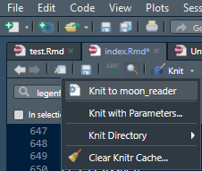
.leg-fig[
Réaliser un `Knit` du R Markdown dans R Studio. 
]
]


---

## "Tricoter" son R Markdown

.pull-left-c[

Le R Markdown est exporté en .HTML (ou .pdf, ou .doc) en réalisant un **`knit`** du .Rmd. Cette action génère un fichier qui :

- Inteprète les métadonnées associées au document (nom d'auteurs, styles graphiques, etc.)
- Transforme la syntaxe Markdown dans un balisage interprété par le fichier de sortie désiré. 
- Exécute les `chunks` (lire, afficher, exécuter ou non le code inclut dans le .Rmd).

]

.pull-right-c[
Ceci...
<br>

]

---

## "Tricoter" son R Markdown

.pull-left-c[

Le R Markdown est exporté en .HTML (ou .pdf, ou .doc) en réalisant un **`knit`** du .Rmd. Cette action génère un fichier qui :

- Inteprète les métadonnées associées au document (nom d'auteurs, styles graphiques, etc.)
- Transforme la syntaxe Markdown dans un balisage interprété par le fichier de sortie désiré. 
- Exécute les `chunks` (lire, afficher, exécuter ou non le code inclut dans le .Rmd).

]

.pull-right-c[
Génère cela 
<br>
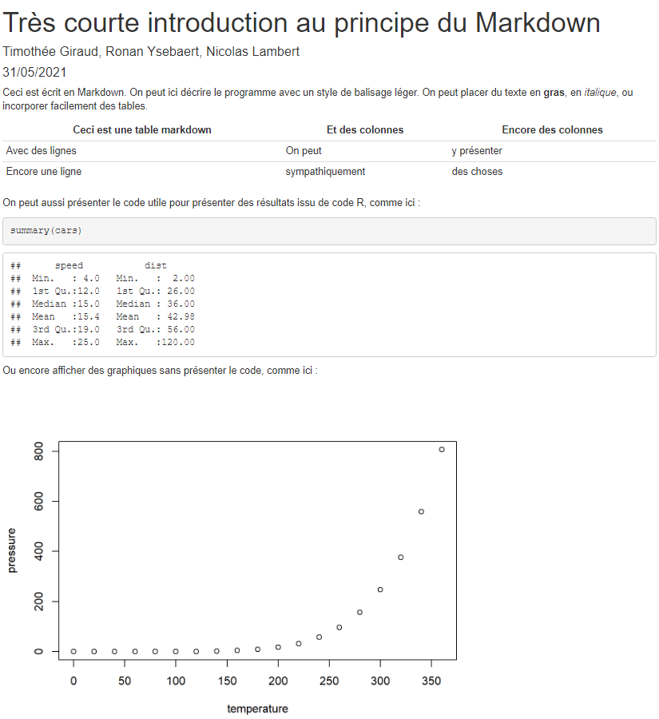

]

---

class: action

## A vous de jouer ! 

.pull-left-c[
###Débutant
**Créez un document R Markdown depuis un modèle**
- Créer un dossier pour l'atelier.
- Créez un document R Markdown (*file > New File > R Markdown > Document*).
- Enregistrez le Rmd dans ce dossier. 
- Renseignez les métadonnées du Rmd (nom, date).
- Knitez le document.
- Testez plusieurs thèmes en modifiant les métadonnées (`cerulean`, `cosmo`, `flatly`, `journal`,
`lumen`, `paper`, `readable`, `sandstone`,)

```yaml
---
title: Un R Markdown formidable en gestation
author: Un auteur qui semble maitriser cette technologie
date: 27 juin 2021
output:
  html_document:
*    theme: united 
    toc: true
    number_sections: true
---
```

]

.pull-right-c[
###Confirmé 
**Préparez un espace de travail reproductible pour l'analyse**

- Téléchargez et décompressez les données associées à l'exercice : shorturl.at/rFGKT 
- Choisissez un modèle de document issu du package `rmdformats`.
- Nommez le .Rmd **index**, le placer à la racine du dossier précédemment téléchargé. 
- Renseignez les métadonnées du Rmd (YAML), et jouez avec les [options](https://bookdown.org/yihui/rmarkdown/html-document.html) 
]


`r countdown(minutes = 10, seconds = 00, top = 0)`

---


name: part3
class: inverse, center, middle

# Partie 3. La syntaxe Markdown

---

## Markdown

Un langage de balisage léger largement utilisé dans les blogs, forum, outils collaboratifs (OpenStreetMap ou GitHub utilisent des dérivés du [Markdown](https://www.markdownguide.org/tools/) pour faciliter les échanges entre les utilisateurs, par exemple). 

<p align="center">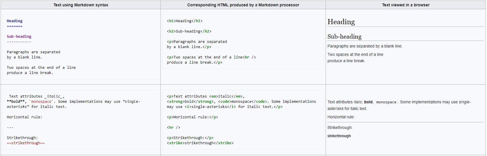</p>


---
## En-têtes

Le signe **`#`** introduit les niveaux de titres (jusqu'à 5 niveaux). 

.pull-left[

.inline-c[&#x23;Europe] devient

.out-t[

# Europe

]

.inline-c[&#x23;&#x23; France] devient

.out-t[

## France

]

]

.pull-right[

.inline-c[&#x23;&#x23;&#x23; Nouvelle-Aquitaine] devient

.out-t[

### Nouvelle-Aquitaine

]

.inline-c[&#x23;&#x23;&#x23;&#x23; Charentes-Maritimes] devient

.out-t[

#### Charentes-Maritimes

]

.inline-c[&#x23;&#x23;&#x23;&#x23;&#x23; Saint-Pierre d'Oléron] devient

.out-t[

##### Saint-Pierre d'Oléron

]

]


---

## Accentuations

Les signes **`*`** et **`_`** gèrent les accentuations. 

<span style="background-color: #e5e5e5; border-radius: 3px; padding: 4px; font-family: 'Source Code Pro', 'Lucida Console', Monaco, monospace;">&#42;&#42;Un mot important&#42;&#42;</span> devient .out-t[**Un mot important**]

<span style="background-color: #e5e5e5; border-radius: 3px; padding: 4px; font-family: 'Source Code Pro', 'Lucida Console', Monaco, monospace;">&#42;Une citation&#42;</span> devient .out-t[*Une citation*]

<span style="background-color: #e5e5e5; border-radius: 3px; padding: 4px; font-family: 'Source Code Pro', 'Lucida Console', Monaco, monospace;">&#42;&#42;&#42;Une citation importante&#42;&#42;&#42;</span> devient .out-t[***Une citation importante***]

---

## Listes

Les lignes introduites par **`*`**, **`+`** ou **`-`** génèrent des listes. 

```{r eval=FALSE}
- books
- articles
- reports
```

.out-t[

- books
- articles
- reports

]

---

## Tables

Créer des tables (syntaxe simple) 

<br>

.pull-left[

```{r eval=FALSE, tidy=FALSE}
    Centered         Right-Aligned 
----------------  ----------------
First cell        First cell      
Second cell       Second cell   
Third cell        Third cell  
                                                                               #<<
: A hand-made table with R Markdown                                      
                                                                               #<<
```

]

.pull-right[

<center>Table 1: A hand-made table with R Markdown</center> 
<br>

| &nbsp;&nbsp;&nbsp; Centered  &nbsp;&nbsp;&nbsp; |  &nbsp;&nbsp;&nbsp;&nbsp;&nbsp;&nbsp; Right-Aligned |               
|:----------------------------------------------: | --------------------------------------------------: | 
| First cell | First cell | 
| Second cell| Second cell | 
| Third cell | Third  cell |       


]

---

## Tables

[Tables Generator](https://www.tablesgenerator.com/) est utile pour mettre en forme sa table et la transformer en diverses syntaxes de balisage, dont Markdown. 

<p align="center">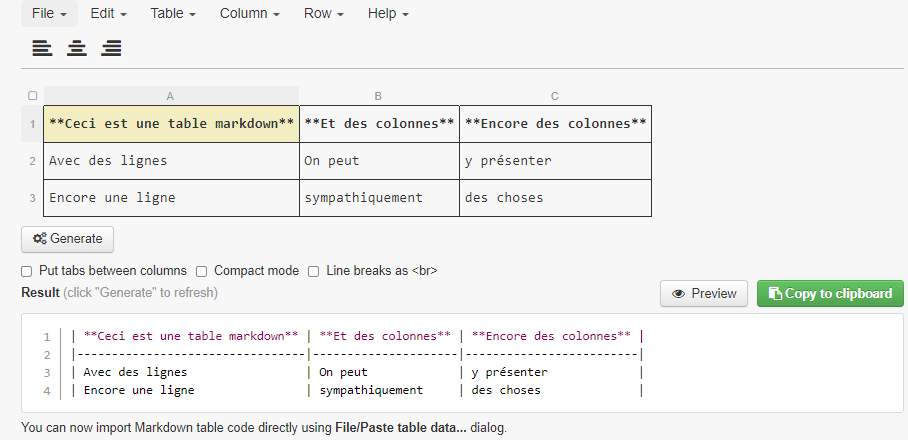</p>

---

## Liens 

Associer du texte à des URL

<span style="background-color: #e5e5e5; border-radius: 3px; padding: 4px; font-family: 'Source Code Pro', 'Lucida Console', Monaco, monospace;">&#91;La Vieille Perrotine](https&#58;//www.caes.cnrs.fr/sejours/la-vieille-perrotine/)</span> devient .out-t[[La Vieille Perrotine](https://www.caes.cnrs.fr/sejours/la-vieille-perrotine/)]

<span style="background-color: #e5e5e5; border-radius: 3px; padding: 4px; font-family: 'Source Code Pro', 'Lucida Console', Monaco, monospace;">&#60;https&#58;//www.caes.cnrs.fr/sejours/la-vieille-perrotine/></span> devient .out-t[<https://www.caes.cnrs.fr/sejours/la-vieille-perrotine/>] aussi

--

Associer une adresse mail

<span style="background-color: #e5e5e5; border-radius: 3px; padding: 4px; font-family: 'Source Code Pro', 'Lucida Console', Monaco, monospace;">&#91;me contacter](mailto&#58;ronan.ysebaert@cnrs.fr)</span><sup></sup> devient .out-t[[me contacter](mailto:ronan.ysebaert@cnrs.fr)]

<span style="background-color: #e5e5e5; border-radius: 3px; padding: 4px; font-family: 'Source Code Pro', 'Lucida Console', Monaco, monospace;">&#60;ronan.ysebaert@cnrs.fr&#62;</span> devient .out-t[<ronan.ysebaert@cnrs.fr>]


---

## Image

``


---

## Limites de Markdown

Il est parfois nécessaire d'introduire du code html pour dimensionner des éléments graphiques sur mesure.

`<p align="center"></p>`

<p align="center"></p>


---

class: action


## A vous de jouer ! 

**Enrichissez le .Rmd précédemment généré avec de la syntaxe Markdown** 

.pull-left[
### Débutant

- **Titres**.  Rajouter 3 titres de niveau 2 : *Description du jeu de données*, *Résumé statistique*, *Représentation graphique*
- **Contenu**. Rappeler dans la première partie (syntaxe Markdown) l'origine du jeu de données : *Proposé par McNeil en 1977, ce jeu de données délivre la vitesse d'une voiture et la distance requise pour s'arrêter dans les années 1920*. 
- Un élément de texte en gras, un élément en italique. 

]

.pull-right[
###Confirmé 
- **Titres**. 3 titres de niveau 2 : *Import des données*, *La population dans les environs*, *Session info*. 
- **Figures **. Incorporez l'image du centre CNRS choisi (dossier fig), adaptez sa taille. 
- **Table**.  Créer une table rappelant les sources mobilisées dans l'exercice : shorturl.at/kDIK6 
]

`r countdown(minutes = 10, seconds = 00, top = 0)`

---

name: part4
class: inverse, center, middle

# Partie 4. Bonnes pratiques (code)

---

## Un code exécutable et lisible

Un code **propre** et **fonctionnel** peut être lu et amélioré par un autre auteur (ou par soi-même, longtemps après).

**Un code fonctionnel**
- S'assurer au préalable que son code fonctionne sans erreur. 
- N'est pas redondant : pour des opérations répétitives, créer des fonctions ou des boucles.  

Un code [bien écrit](https://dl.leneveu.fr/public/Coder_Proprement.pdf) est :

- [Bien structuré](https://www.r-bloggers.com/2018/09/r-code-best-practices/).
- Facile à lire, par soi-même et par les autres (indentation, noms d'objets) 
- Organisé de façon logique (simplicité). 
- Explicite et montre les intentions du développeur (commentaires). 
- A jour (utiliser la dernière version des packages, si ce n'est pas le cas, l'expliquer). 


---

## Un code clair et lisible

.pull-left[
Une carte de la population communale 30 km autour du centre CNRS de Saint-Pierre d'Oléron.
```{r, eval = TRUE, echo = FALSE, warning = FALSE, message = FALSE, fig.height = 5}
# Voici mon bloc de code qui fait une carte en cercles proportionnels en utilisant le package mapsf. Les valeurs sont ordonnées afin de faire apparaître les cinq premières valeurs sur la carte en tant que label. 
library(sf)
library(mapsf)
library(dplyr)
communespopulation2019<-st_read(dsn="data/oleron.gpkg",layer="com",quiet=TRUE)
communes30kmautour<-st_read(dsn="data/oleron.gpkg",layer="cnrsBuf",quiet=TRUE)
mf_map(communes30kmautour,col="lightblue",border=NA)
mf_map(communespopulation2019,col="white",add=TRUE)
mf_map(communespopulation2019,type="prop",var="POP_2019",leg_pos="topleft",col="grey34",
border="white",leg_title="Population 2019")
communespopulation2019<-arrange(communespopulation2019, desc(POP_2019))
mf_label(x = communespopulation2019[1:5,], var = "LAU_NAME", halo = TRUE, overlap = FALSE, lines = FALSE, bg = "white")
mf_map(communes30kmautour, col=NA, lwd=2, add=TRUE)
mf_layout(title=paste0(round(sum(communespopulation2019$POP_2019),-2), " habitants dans les bourgs des environs"),credits="Ecole Thématique SIG-R, RIATE,2021\n,Source : Eurostat - GISCO, 2021", arrow = FALSE)
```
]

--

.pull-left[
Et le code R qui a permis de générer cette carte. Envie de le reproduire ? 

```{r, eval = FALSE, echo = TRUE}
# Voici mon bloc de code qui fait une carte en cercles proportionnels en utilisant le package mapsf. Les valeurs sont ordonnées afin de faire apparaître les cinq premières valeurs sur la carte en tant que label. 
library(sf); library(mapsf); library(dplyr)
communespopulation2019<-st_read(dsn="data/oleron.gpkg",layer="com",quiet=TRUE)
communes30kmautour<-st_read(dsn="data/oleron.gpkg",layer="cnrsBuf",quiet=TRUE)
mf_map(communes30kmautour,col="lightblue",border=NA);mf_map(communespopulation2019,col="white",add=TRUE)
mf_map(communespopulation2019,type="prop",var="POP_2019",leg_pos="topleft",col="grey34",border="white",leg_title="Population 2019")
communespopulation2019<-arrange(communespopulation2019,desc(POP_2019))
mf_label(x=communespopulation2019[1:5,],var="LAU_NAME",halo=TRUE,overlap=FALSE,lines=FALSE,bg="white")
mf_map(communes30kmautour,col=NA,lwd=2,add=TRUE)
mf_layout(title=paste0(round(sum(communespopulation2019$POP_2019),-2)," habitants dans les bourgs des environs"),credits="Ecole Thématique SIG-R, RIATE,2021\n,Source : Eurostat - GISCO, 2021",arrow=FALSE)
```
]


---

## Indentation et espace

Respecter l'indentation, la hiérarchie entre les instructions. Une instruction par ligne (de longueur limitée).

```{r, eval = FALSE, echo = TRUE}
# Voici mon bloc de code qui fait une carte en cercles proportionnels en utilisant le package mapsf. Les valeurs sont ordonnées afin de faire apparaître les cinq premières valeurs sur la carte en tant que label. 
*library(sf); library(mapsf); library(dplyr)
*communespopulation2019<-st_read(dsn="data/oleron.gpkg",layer="com",quiet=TRUE)
*communes30kmautour<-st_read(dsn="data/oleron.gpkg",layer="cnrsBuf",quiet=TRUE)
*mf_map(communes30kmautour,col="lightblue",border=NA);mf_map(communespopulation2019,col="white",add=TRUE)
*mf_map(communespopulation2019,type="prop",var="POP_2019",leg_pos="topleft",col="grey34",border="white",leg_title="Population 2019")
*communespopulation2019<-arrange(communespopulation2019,desc(POP_2019))
*mf_label(x=communespopulation2019[1:5,],var="LAU_NAME",halo=TRUE,overlap=FALSE,lines=FALSE,bg="white")
*mf_map(communes30kmautour,col=NA,lwd=2,add=TRUE)
*mf_layout(title=paste0(round(sum(communespopulation2019$POP_2019),-2)," habitants dans les bourgs des environs"),credits="Ecole Thématique SIG-R, RIATE,2021\n,Source : Eurostat - GISCO, 2021",arrow=FALSE)
```


---

## Indentation et espace

Respecter l'indentation, la hiérarchie entre les instructions. Une instruction par ligne (de longueur limitée).

```{r, eval = FALSE, echo = TRUE}
# Voici mon bloc de code qui fait une carte en cercles proportionnels en utilisant le package mapsf. Les valeurs sont ordonnées afin de faire apparaître les cinq premières valeurs sur la carte en tant que label. 
library(sf)
library(mapsf)
library(dplyr)
communespopulation2019 <- st_read(dsn = "data/oleron.gpkg", layer = "com", quiet = TRUE)
communes30kmautour <- st_read(dsn = "data/oleron.gpkg", layer = "cnrsBuf", quiet = TRUE)
mf_map(communes30kmautour, col = "lightblue", border = NA)
mf_map(communespopulation2019, col = "white", add = TRUE)
mf_map(communespopulation2019, type = "prop", var = "POP_2019", leg_pos = "topleft",
       col = "grey34", border = "white", leg_title = "Population 2019")
communespopulation2019 <- arrange(communespopulation2019, desc(POP_2019))
mf_label(x = communespopulation2019[1:5,], var = "LAU_NAME", halo = TRUE, 
          overlap = FALSE, lines = FALSE, bg = "white")
mf_map(communes30kmautour, col = NA, lwd = 2, add = TRUE)
mf_layout(title = paste0(round(sum(communespopulation2019$POP_2019),-2),
                          " habitants dans les bourgs des environs"),
           credits = "Ecole Thématique SIG-R, RIATE,2021\n,Source : Eurostat - GISCO, 2021",
           arrow = FALSE)
```

---

## Organiser ses commentaires

Étape après étape, apporte une indication sur le choix de conception, court et explicite. 

```{r, eval = FALSE, echo = TRUE}
*# Voici mon bloc de code qui fait une carte en cercles proportionnels en utilisant le package mapsf. Les valeurs sont ordonnées afin de faire apparaître les cinq premières *valeurs sur la carte en tant que label. 
library(sf)
library(mapsf)
library(dplyr)
communespopulation2019 <- st_read(dsn = "data/oleron.gpkg", layer = "com", quiet = TRUE)
communes30kmautour <- st_read(dsn = "data/oleron.gpkg", layer = "cnrsBuf", quiet = TRUE)
mf_map(communes30kmautour, col = "lightblue", border = NA)
mf_map(communespopulation2019, col = "white", add = TRUE)
mf_map(communespopulation2019, type = "prop", var = "POP_2019", leg_pos = "topleft",
       col = "grey34", border = "white", leg_title = "Population 2019")
communespopulation2019 <- arrange(communespopulation2019, desc(POP_2019))
mf_label(x = communespopulation2019[1:5,], var = "LAU_NAME", halo = TRUE, 
          overlap = FALSE, lines = FALSE, bg = "white")
mf_map(communes30kmautour, col = NA, lwd = 2, add = TRUE)
mf_layout(title = paste0(round(sum(communespopulation2019$POP_2019),-2),
                          " habitants dans les bourgs des environs"),
           credits = "Ecole Thématique SIG-R, RIATE,2021\n,Source : Eurostat - GISCO, 2021",
           arrow = FALSE)
```


---

## Organiser ses commentaires

Étape après étape, apporte une indication sur le choix de conception, court et explicite. 

```{r, eval = FALSE, echo = TRUE}
*# Librairies utilisées
library(sf)
library(mapsf)
library(dplyr)

*# Import des données
communespopulation2019 <- st_read(dsn = "data/oleron.gpkg", layer = "com", quiet = TRUE)
communes30kmautour <- st_read(dsn = "data/oleron.gpkg", layer = "cnrsBuf", quiet = TRUE)

*# Cartographie - Population communale
mf_map(communes30kmautour, col = "lightblue",border = NA)
mf_map(communespopulation2019, col = "white", add = TRUE)
mf_map(communespopulation2019, type = "prop", var = "POP_2019",leg_pos = "topleft",
       col="grey34", border = "white", leg_title = "Population 2019")

*# Ordonner les valeurs les plus élevées et les afficher
communespopulation2019 <- arrange(communespopulation2019, desc(POP_2019))
mf_label(x = communespopulation2019[1:5,], var = "LAU_NAME", halo = TRUE,
         overlap = FALSE, lines = FALSE, bg = "white")
mf_map(communes30kmautour, col = NA, lwd = 2, add = TRUE)

*# Habillage cartographique
mf_layout(title = paste0(round(sum(communespopulation2019$POP_2019),-2),
                       " habitants dans les bourgs des environs"),
          credits = "Ecole Thématique SIG-R, RIATE,2021\n,Source : Eurostat - GISCO, 2021",
          arrow = FALSE)
```


---
## Optimiser les noms d'objets

Des noms prononçables et révélateurs des intentions, plutôt en anglais. Veiller à ne pas utiliser des mots "réservés" par le langage de programmation (plot, sum...)

```{r, eval = FALSE, echo = TRUE}
# Librairies utilisées
library(sf)
library(mapsf)
library(dplyr)

# Import des données
*communespopulation2019 <- st_read(dsn = "data/oleron.gpkg", layer = "com", quiet = TRUE)
*communes30kmautour <- st_read(dsn = "data/oleron.gpkg", layer = "cnrsBuf", quiet = TRUE)

# Cartographie - Population communale
*mf_map(communes30kmautour, col = "lightblue",border = NA)
*mf_map(communespopulation2019, col = "white", add = TRUE)
*mf_map(communespopulation2019, type = "prop",var="POP_2019",leg_pos = "topleft",
       col="grey34", border = "white", leg_title = "Population 2019")

# Ordonner les valeurs les plus élevées et les afficher
*communespopulation2019 <- arrange(communespopulation2019, desc(POP_2019))
*mf_label(x = communespopulation2019[1:5,], var = "LAU_NAME", halo = TRUE,
         overlap = FALSE, lines = FALSE, bg = "white")
*mf_map(communes30kmautour, col = NA, lwd = 2, add = TRUE)

# Habillage cartographique
*mf_layout(title = paste0(round(sum(communespopulation2019$POP_2019),-2),
                       " habitants dans les bourgs des environs"),
          credits = "Ecole Thématique SIG-R, RIATE,2021\n,Source : Eurostat - GISCO, 2021",
          arrow = FALSE)
```


---

## Optimiser les noms d'objets

Des noms prononçables et révélateurs des intentions, plutôt en anglais. Veiller à ne pas utiliser des mots "réservés" par le langage de programmation (plot, sum...)

```{r, eval = FALSE, echo = TRUE}
# Librairies utilisées
library(sf)
library(mapsf)
library(dplyr)

# Import des données
*com <- st_read(dsn = "data/oleron.gpkg", layer = "com", quiet = TRUE)
*buf <- st_read(dsn = "data/oleron.gpkg", layer = "cnrsBuf", quiet = TRUE)

# Cartographie - Population communale
*mf_map(buf, col="lightblue",border = NA)
*mf_map(com, col = "white", add = TRUE)
*mf_map(com, type = "prop",var="POP_2019",leg_pos = "topleft",
       col = "grey34", border = "white", leg_title = "Population 2019")

# Ordonner les valeurs les plus élevées et les afficher
*com <- arrange(com, desc(POP_2019)) 
*mf_label(x = com[1:5,], var="LAU_NAME", halo=TRUE, overlap=FALSE,
         lines = FALSE, bg = "white")
*mf_map(com, col = NA, lwd = 2, add = TRUE)

# Habillage cartographique
*mf_layout(title = paste0(round(sum(com$POP_2019),-2),
                       " habitants dans les bourgs des environs"),
          credits = "Ecole Thématique SIG-R, RIATE,2021\n,Source : Eurostat - GISCO, 2021",
          arrow = FALSE)
```

---

## Limiter les dépendances

Mieux vaut supprimer l'appel de librairies additionnelles si c'est juste pour une instruction basique. 

```{r, eval = FALSE, echo = TRUE}
# Librairies utilisées
library(sf)
library(mapsf)
*library(dplyr)

# Import des données
com <- st_read(dsn = "data/oleron.gpkg", layer = "com", quiet = TRUE)
buf <- st_read(dsn = "data/oleron.gpkg", layer = "cnrsBuf", quiet = TRUE)

# Cartographie - Population communale
mf_map(buf, col="lightblue",border = NA)
mf_map(com, col = "white", add = TRUE)
mf_map(com, type = "prop",var="POP_2019",leg_pos = "topleft",
       col = "grey34", border = "white", leg_title = "Population 2019")

# Ordonner les valeurs les plus élevées et les afficher
*com <- arrange(com, desc(POP_2019)) 
mf_label(x = com[1:5,], var="LAU_NAME", halo=TRUE, overlap=FALSE,
         lines = FALSE, bg = "white")
mf_map(com, col = NA, lwd = 2, add = TRUE)

# Habillage cartographique
mf_layout(title = paste0(round(sum(com$POP_2019),-2),
                       " habitants dans les bourgs des environs"),
          credits = "Ecole Thématique SIG-R, RIATE,2021\n,Source : Eurostat - GISCO, 2021",
          arrow = FALSE)
```


---

## Limiter les dépendances

Mieux vaut supprimer l'appel de librairies additionnelles si c'est juste pour une instruction basique. 

```{r, eval = FALSE, echo = TRUE}
# Librairies utilisées
library(sf)
library(mapsf)

# Import des données
com <- st_read(dsn = "data/oleron.gpkg", layer = "com", quiet = TRUE)
buf <- st_read(dsn = "data/oleron.gpkg", layer = "cnrsBuf", quiet = TRUE)

# Cartographie - Population communale
mf_map(buf, col="lightblue",border = NA)
mf_map(com, col = "white", add = TRUE)
mf_map(com, type = "prop",var="POP_2019",leg_pos = "topleft",
       col = "grey34", border = "white", leg_title = "Population 2019")

# Ordonner les valeurs les plus élevées et les afficher
*com <- com[order(com$POP_2019, decreasing = TRUE),] # Au lieu de arrange de dplyr
mf_label(x = com[1:5,], var="LAU_NAME", halo=TRUE, overlap=FALSE,
         lines = FALSE, bg = "white")
mf_map(com, col = NA, lwd = 2, add = TRUE)

# Habillage cartographique
mf_layout(title = paste0(round(sum(com$POP_2019),-2),
                       " habitants dans les bourgs des environs"),
          credits = "Ecole Thématique SIG-R, RIATE,2021\n,Source : Eurostat - GISCO, 2021",
          arrow = FALSE)
```


---

## En anglais ! 

Pour une large diffusion, préférez l'anglais (dépôt GitHub). 

```{r, eval = FALSE, echo = TRUE}
# Import libraries
library(sf)
library(mapsf)

# Data import
com <- st_read(dsn = paste0("data/oleron.gpkg"), layer = "com", quiet = TRUE)
buf <- st_read(dsn = paste0("data/oleron.gpkg"), layer = "cnrsBuf", quiet = TRUE)

# Cartography - Municipal population
mf_map(buf, col = "lightblue", border = NA) # Analysis perimeter
mf_map(com, col = "white", add = TRUE) # Display muncipalities
mf_map(com, type = "prop", var = "POP_2019", leg_pos = "topleft", col = "grey34",
       border = "white", leg_title = "Population 2019") # Map
mf_map(buf, col = NA, lwd = 2, add = TRUE) # Analysis perimeter contour

# Order higher values and display them
com <- com[order(com$POP_2019, decreasing = TRUE),]
mf_label(x = com[1:5,], var = "LAU_NAME", halo = TRUE, overlap = FALSE, 
         lines = FALSE, bg = "white") # Label des 5 communes les plus peuplées 

# Map layout
mf_layout(title = paste0(round(sum(com$POP_2019),-2),
                         " habitants dans les bourgs des environs"),
          credits = paste0("Ecole Thématique SIG-R, RIATE, 2021\n",
                           "Source : Eurostat - GISCO, 2021"), arrow = FALSE)
```


---

class: action

## A vous de jouer ! 

.pull-left[
###Débutant

**Créez un script R (File > New File > R Script) et embellissez le code suivant :**

```{r, eval = FALSE}
#Mon bloc de code qui transforme les valeurs du jeu de données
#d'exemple en km/h et mètres, réalise la moyenne des deux 
#variables et une régression linéaire
data(cars)
cars$speed_kilometreheure<-cars$speed*1.60934  
cars$dist_metres<-cars$dist*0.3048; summary(cars)
plot(x=cars$speed_kilometreheure,y=cars$dist_metres, 
ylab="Distance nécessaire à l'arrêt (m)",
clab="Vitesse (km/h)")
abline(lm(cars$dist_metres~cars$speed_kilometreheure),
lty=2,lwd=1,col="red")
```

]

.pull-right[
###Confirmé

**Ouvrez le fichier script.R et améliorez cette section de code**
```{r, eval = FALSE}
# Voici mon bloc de code qui fait une carte en cercles 
#proportionnels en utilisant le package mapsf. Les valeurs
#sont ordonnées afin de faire apparaître les cinq premières
#valeurs sur la carte en tant que label. 
library(sf); library(mapsf); library(dplyr)
communespopulation2019<-st_read(dsn="data/oleron.gpkg",
layer="com",quiet=TRUE)
communes30kmautour<-st_read(dsn="data/oleron.gpkg",
layer="cnrsBuf",quiet=TRUE)
mf_map(communes30kmautour,col="lightblue",border=NA)
mf_map(communespopulation2019,col="white",add=TRUE)
mf_map(communespopulation2019,type="prop",var="POP_2019",
leg_pos="topleft",col="grey34",border="white",
leg_title="Population 2019")
communespopulation2019<-arrange(communespopulation2019,desc(POP_2019))
mf_label(x=communespopulation2019[1:5,],var="LAU_NAME",
halo=TRUE,overlap=FALSE,lines=FALSE,bg="white")
mf_map(communes30kmautour,col=NA,lwd=2,add=TRUE)
mf_layout(title=paste0(round(sum(communespopulation2019$POP_2019),-2),
" habitants dans les bourgs des environs"),
credits="Ecole Thématique SIG-R, RIATE,2021\n,Source : 
Eurostat - GISCO, 2021",
arrow=FALSE)
```


]


`r countdown(minutes = 10, seconds = 00, top = 0)`


---
name: part5
class: inverse, center, middle

# Partie 5. Jouer du code dans du R Markdown


---

## Chunks 

Le code est à placer dans des `chunks` (tronçons), délimités par des triples *backticks* (Code > Insert Chunk dans R Studio)

````markdown
'''{r, library_import, warning = FALSE, message = FALSE}
# Import des librairies utiles à l'atelier
library(sf) # Manipulation de données spatiales
library(mapsf) # Représentations cartographiques
library(potential) # Calcul de potentiel
'''
````

- `r` est une option du chunk, qui indique la nature du langage à jouer.
- `library_import` : Chaque chunk peut être nommé (utile pour un document comprenant de nombreux chunks).
- `warning = FALSE, message = FALSE` : Chaque chunk est paramétrable (chunk options).

<br> 

> Un chunk peut être placé à n'importe quel endroit du Rmd.

> Préférez plusieurs chunks bien paramétrés et documentés à un seul (long) bloc de code.

> Bien différencier le commentaire précédent l'instruction du code *(#)* et ceux rédigés en Markdown, destinés à expliquer la démarche globale d'analyse. 


---

## Options de chunks 

Ces chunks sont paramétrés par défaut (TRUE / FALSE)

- eval = TRUE : Exécuter le code à la compilation.
- echo = TRUE : Afficher le code.
- warning = TRUE : Afficher les avertissements.
- message = TRUE : Afficher les messages.
- error = FALSE : Afficher les messages d'erreur. 
- cache = FALSE : Placer en cache le code joué lors du premier knit. 
- fig.width = 7 : Largeur des sorties graphiques en pouce. 
- fig.height = 7 : Hauteur des sorties graphiques en pouces.

La présentation précise des paramètres est rappelée dans la [documentation de knitr](https://yihui.org/knitr/options/), et synthétisée dans les [cheatsheet de RMarkdown](https://www.rstudio.com/wp-content/uploads/2015/02/rmarkdown-cheatsheet.pdf). 

---

###{r eval = FALSE, echo = TRUE}

Afficher le code, sans jouer les résultats.

```{r eval = FALSE, echo = TRUE}
# Librairies utiles
library(sf)
library(mapsf)

# centre CNRS
cent <- read.csv(file = "data/cnrs.csv")
com <- st_read(dsn = "data/LAU_RG_01M_2019_4326.shp", quiet = TRUE)

# Créer un buffer autour du centre
cnrs <- cent[cent$file == "aussois",]
cnrs <- st_as_sf(cnrs, coords = c("longitude", "latitude"), crs = 4326)
cnrs <- st_transform(cnrs, 2154)
buf <- st_buffer(cnrs, dist = 30000)

# Les données originelles prenaient l'Europe entière  
com <- st_transform(com, 2154)
com <- st_intersection(com, buf)  

# Cartography - Municipal population
mf_map(com, col = "white") # Display muncipalities
mf_map(com, type = "prop", var = "POP_2019", leg_pos = "topleft", col = "grey34",
       border = "white", leg_title = "Population 2019") # Map
mf_map(buf, col = NA, lwd = 2, add = TRUE) # Analysis perimeter contour
mf_map(cnrs, pch = 17, col = "darkred", cex = 2, add = TRUE) # Location CNRS
mf_label(x = cnrs, var = "centre", halo = TRUE, cex = 0.9, pos = 1, 
         overlap = FALSE, lines = FALSE, r = 0.15) # Label CNRS
mf_layout(title = paste0(round(sum(com$POP_2019),-2), # Layout
                         " habitants dans les bourgs des environs"),
          credits = "Ecole Thématique SIG-R, RIATE, 2021\nSource : Eurostat - GISCO, 2021", arrow = FALSE)
```


---
###{r eval = TRUE, echo = FALSE} 
 
Jouer uniquement le code, sans afficher le code.

```{r eval = TRUE, echo = FALSE}
# Librairies utiles
library(sf)
library(mapsf)

# centre CNRS
cent <- read.csv(file = "data/cnrs.csv")
com <- st_read(dsn = "data/LAU_RG_01M_2019_4326.shp", quiet = TRUE)

# Créer un buffer autour du centre
cnrs <- cent[cent$file == "aussois",]
cnrs <- st_as_sf(cnrs, coords = c("longitude", "latitude"), crs = 4326)
cnrs <- st_transform(cnrs, 2154)
buf <- st_buffer(cnrs, dist = 30000)

# Les données originelles prenaient l'Europe entière  
com <- st_transform(com, 2154)
com <- st_intersection(com, buf)  

# Cartography - Municipal population
mf_map(com, col = "white") # Display muncipalities
mf_map(com, type = "prop", var = "POP_2019", leg_pos = "topleft", col = "grey34",
       border = "white", leg_title = "Population 2019") # Map
mf_map(buf, col = NA, lwd = 2, add = TRUE) # Analysis perimeter contour
mf_map(cnrs, pch = 17, col = "darkred", cex = 2, add = TRUE) # Location CNRS
mf_label(x = cnrs, var = "centre", halo = TRUE, cex = 0.9, pos = 1, 
         overlap = FALSE, lines = FALSE, r = 0.15) # Label CNRS
mf_layout(title = paste0(round(sum(com$POP_2019),-2), # Layout
                         " habitants dans les bourgs des environs"),
          credits = "Ecole Thématique SIG-R, RIATE, 2021\nSource : Eurostat - GISCO, 2021", arrow = FALSE)
```
---

###{r eval = TRUE, echo = FALSE, warning = FALSE} 

Retirer le message d'avertissement (lié à une opération SIG de `sf` dans ce cas). 

```{r eval = TRUE, echo = FALSE, warning = FALSE}
# Librairies utiles
library(sf)
library(mapsf)

# centre CNRS
cent <- read.csv(file = "data/cnrs.csv")
com <- st_read(dsn = "data/LAU_RG_01M_2019_4326.shp", quiet = TRUE)

# Créer un buffer autour du centre
cnrs <- cent[cent$file == "aussois",]
cnrs <- st_as_sf(cnrs, coords = c("longitude", "latitude"), crs = 4326)
cnrs <- st_transform(cnrs, 2154)
buf <- st_buffer(cnrs, dist = 30000)

# Les données originelles prenaient l'Europe entière  
com <- st_transform(com, 2154)
com <- st_intersection(com, buf)  

# Cartography - Municipal population
mf_map(com, col = "white") # Display muncipalities
mf_map(com, type = "prop", var = "POP_2019", leg_pos = "topleft", col = "grey34",
       border = "white", leg_title = "Population 2019") # Map
mf_map(buf, col = NA, lwd = 2, add = TRUE) # Analysis perimeter contour
mf_map(cnrs, pch = 17, col = "darkred", cex = 2, add = TRUE) # Location CNRS
mf_label(x = cnrs, var = "centre", halo = TRUE, cex = 0.9, pos = 1, 
         overlap = FALSE, lines = FALSE, r = 0.15) # Label CNRS
mf_layout(title = paste0(round(sum(com$POP_2019),-2), # Layout
                         " habitants dans les bourgs des environs"),
          credits = "Ecole Thématique SIG-R, RIATE, 2021\nSource : Eurostat - GISCO, 2021", arrow = FALSE)
```

---

###{r eval = TRUE, echo = FALSE, warning = FALSE, fig.align='center', fig.width= 9, fig.height = 6}

Paramétrer les sorties graphiques.

```{r eval = TRUE, echo = FALSE, warning = FALSE, fig.align='center', fig.width= 9, fig.height= 6}
# Librairies utiles
library(sf)
library(mapsf)

# centre CNRS
cent <- read.csv(file = "data/cnrs.csv")
com <- st_read(dsn = "data/LAU_RG_01M_2019_4326.shp", quiet = TRUE)

# Créer un buffer autour du centre
cnrs <- cent[cent$file == "aussois",]
cnrs <- st_as_sf(cnrs, coords = c("longitude", "latitude"), crs = 4326)
cnrs <- st_transform(cnrs, 2154)
buf <- st_buffer(cnrs, dist = 30000)

# Les données originelles prenaient l'Europe entière  
com <- st_transform(com, 2154)
com <- st_intersection(com, buf)  

# Cartography - Municipal population
mf_map(com, col = "white") # Display muncipalities
mf_map(com, type = "prop", var = "POP_2019", leg_pos = "topleft", col = "grey34",
       border = "white", leg_title = "Population 2019") # Map
mf_map(buf, col = NA, lwd = 2, add = TRUE) # Analysis perimeter contour
mf_map(cnrs, pch = 17, col = "darkred", cex = 2, add = TRUE) # Location CNRS
mf_label(x = cnrs, var = "centre", halo = TRUE, cex = 0.9, pos = 1, 
         overlap = FALSE, lines = FALSE, r = 0.15) # Label CNRS
mf_layout(title = paste0(round(sum(com$POP_2019),-2), # Layout
                         " habitants dans les bourgs des environs"),
          credits = "Ecole Thématique SIG-R, RIATE, 2021\nSource : Eurostat - GISCO, 2021", arrow = FALSE)
```


---

## Setup chunk 

Il est d'usage d'incorporer en début de Markdown un chunk qui introduit l'analyse. Il prend généralement en compte :

- Les options de chunk personnalisées avec `knitr::opts_chunk$set()`
- L'import des librairies requises pour jouer le code.
- L'import des données associées au document. 

````markdown
`r ''```{r, setup, include = FALSE}
# Options de chunk (ensemble du document)
knitr::opts_chunk$set(echo = FALSE, message = FALSE, fig.align='center', fig.width= 9, fig.height= 8)


# Import des librairies
library(sf) # Manipulation de données spatiales
library(mapsf) # Représentations cartographiques
library(potential) # Calcul de potentiel
```


---


## Afficher une table avec knitr

Une table mise en forme (10 communes les plus peuplées autour du centre CNRS d'Aussois)

```{r}
# Sélectionner des colonnes d'intérêt, ordonner sur la population, retirer les géométries
com <- com[order(com$POP_2019, decreasing = TRUE),]
com <- com[1:10,c("GISCO_ID", "LAU_NAME", "POP_2019", "AREA_KM2")]
row.names(com) <- NULL
com <- st_set_geometry(com, NULL)

# Options de chunk (ensemble du document)
knitr::kable(head(com, 10), row.names = F, digits = 1)
```


---

## Afficher une table avec kableExtra et formattable

Des packages utiles pour des [mises en page stylisées et interactives de tables](https://cran.r-project.org/web/packages/kableExtra/vignettes/awesome_table_in_html.html). 

.pull-left[

```{r, eval = FALSE}
library(kableExtra)
library(formattable)

# Paramétrer le tableau
com$AREA_KM2 <- color_tile("white", "orange")(com$AREA_KM2)
com$POP_2019 <- color_bar("lightgreen")(com$POP_2019)


# Tableau
kbl(com, escape = F) %>%
  kable_paper("hover", full_width = F) %>%
  column_spec(3, width = "3cm") %>%
  kable_styling(font_size = 10) %>%
  add_header_above(c("Communes" = 2, "Population et surface" = 2))
```
]

.pull-right[
```{r, echo = FALSE}
# Paramétrer le tableau
com$AREA_KM2 <- color_tile("white", "orange")(com$AREA_KM2)
com$POP_2019 <- color_bar("lightgreen")(com$POP_2019)


# Tableau
kbl(com, escape = F) %>%
  kable_paper("hover", full_width = F) %>%
  column_spec(3, width = "3cm") %>%
  kable_styling(font_size = 10) %>%
  add_header_above(c("Communes" = 2, "Population et surface" = 2))
```

]


---

## Documenter son environnement de travail

`SessionInfo()` permet d'obtenir des informations sur la session et partager son environnement de production. 

.pull-left[

```{r, eval = TRUE, echo = TRUE}
sessionInfo()
```
]

.pull-right[
- La version de R utilisée
- Le système d'exploitation (*platform*)
- Packages de base attachés (*attached base packages*)
- Packages additionnels à charger pour reproduire la documentation et son code. 

]

---

## Documenter son environnement de travail

Certains packages proposent une visualisation plus synthétique de `sessionInfo()`

```{r, eval = TRUE, echo = TRUE}
sessioninfo::session_info()
```


---

class: action

# A vous de jouer ! 

**Adaptez votre R Markdown avec le code mobilisé / proposé durant l'atelier**. 

.pull-left[
### Débutant

- Insérez votre script précédent dans 3 chunks.
- Paramétrez ces chunks différemment.
- Rajoutez une `sessionInfo()` en fin de document. 

]


.pull-right[
### Confirmé

- Choisissez au minium un centre CNRS et une visualisation contenu dans le fichier script.R 
- Insérez ce script de façon cohérente dans votre R Markdown
- Rajoutez une `sessionInfo()` en fin de document. 
]


`r countdown(minutes = 10, seconds = 00, top = 0)`

---


name: part6
class: inverse, center, middle

# Saint-Pierre d'Oléron, un bon choix ?


---

## Un document html utilisant le template `Robobook`

###Mais quel centre de vacances CNRS choisir ? 

.pull-left[

- Une [possible analyse](https://sigr2021.github.io/mardown_data/) suivant les principes de programmation lettrée des données mobilisées dans l'atelier.
- Le [R Markdown](https://github.com/sigr2021/mardown/blob/main/index.Rmd) associé . 
]

.pull-right[
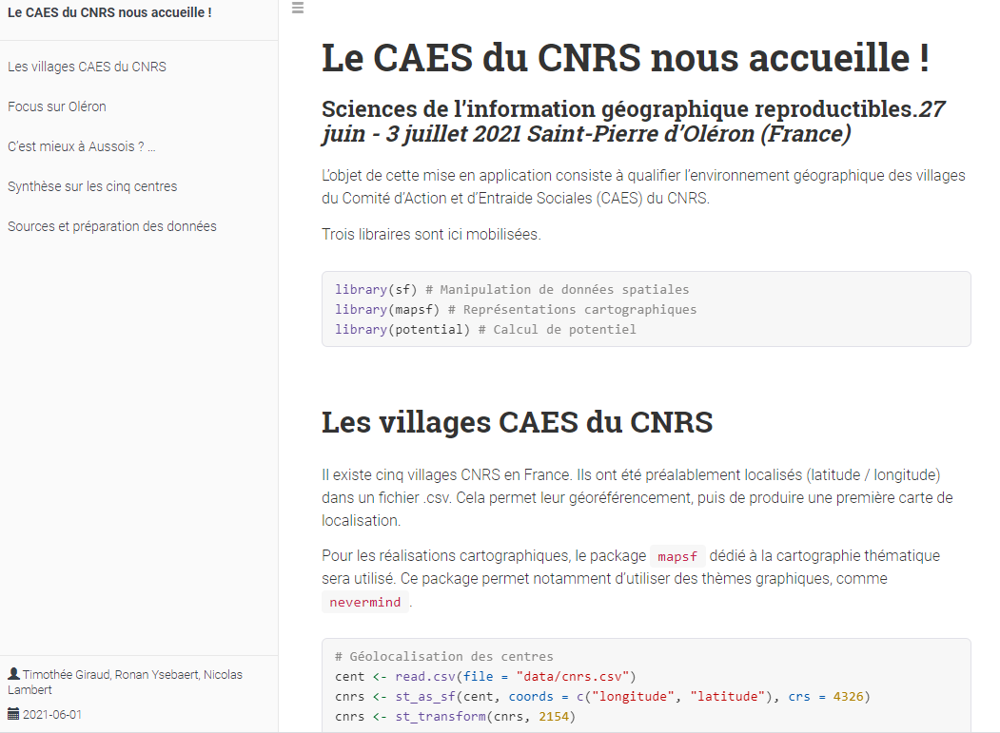
]

---

## Et permet notamment...

De comparer les centres de vacances CNRS sur les critères d'analyse proposés ! 

```{r, echo = FALSE}
# Créer un dataframe vide pour récupérer les données
df <- data.frame(
  cnrs = character(),
  pop = numeric(),
  night = numeric(),
  museum = integer (),
  fort = integer(),
  viewpoint = integer(),
  artwork = integer(),
  monument = integer(),
  stringsAsFactors = FALSE)

df[1:5, "cnrs"] <- c("aussois", "frejus", "gerberal", "oleron", "plantiers")


# Bouche qui itère sur chaque centre du CNRS
for (i in 1:nrow(df)){
  
  # Ouverture du geopackage + somme population rayon 30 km
  com <- st_read(dsn = paste0("data/", df[i,"cnrs"], ".gpkg"), layer = "com", quiet = TRUE)
  df[i, "pop"] <- sum(com$POP_2019, na.rm = TRUE)
  
  # Ouverture de la grille + moyenne de la pollution lumineuse
  grid <- st_read(dsn = paste0("data/", df[i,"cnrs"], ".gpkg"), layer = "grid", quiet = TRUE)
  df[i, "night"] <- mean(grid$World_Atlas_2015, na.rm = TRUE)
  
   # Ouverture de la couche point + dénombrement des équipements par catégorie
  osm <- st_read(dsn = paste0("data/", df[i,"cnrs"], ".gpkg"), layer = "osm", quiet = TRUE)
  tb <- table(osm$value)
  df[i, "museum"] <- tb[4]
  df[i, "fort"] <- tb[2]
  df[i, "viewpoint"] <- tb[5]
  df[i, "artwork"] <- tb[1]
  df[i, "monument"] <- tb[3]
}

# Affichage des résultats
knitr::kable(df, row.names = F, digits = 2)
```


.leg-fig[
*cnrs* (Nom du centre CNRS) et données associées dans un rayon de 30 km *pop* (Population communale 2019, source : Eurostat - GISCO), *night* (Intensité de pollution lumineuse moyenne 2015, source : World Atlas of Artificial Night Sky Brightness V.1.1.), *museum*, *fort*, *viewpoint*, *artwork*, *monument*  (nombre de musées, forts, points de vue, centres d'art et moments en 2021, source : OpenStreetMap et contributeurs).
]
--

---

class: title-slide-final, middle
background-size: 55px
background-position: 9% 15%

# Merci !
<br><br>

Présentation réalisée avec [xaringan](https://github.com/yihui/xaringan) et [RMarkdown](https://rmarkdown.rstudio.com/) et le thème [css rutgers](https://github.com/jvcasillas/ru_xaringan), légèrement modifié.

Credits: contenu et mise en forme s'inspirant de [@oliviergimenez](https://github.com/oliviergimenez), [State of the R](https://stateofther.github.io/), [R Views](https://rviews.rstudio.com/2018/03/08/cran-package-metadata/) et l'ensemble des manuels d'utilisation des packages associés à l'environnement R Markdown.  

<br><br><br>

|                                                                                                            |                                   |
| :--------------------------------------------------------------------------------------------------------- | :-------------------------------- |
| `r icons::fontawesome("envelope")` | ronan.ysebaert@cnrs.fr       |
| `r icons::fontawesome("home")` | [riate.cnrs.fr/](https://riate.cnrs.fr/) |
| `r icons::fontawesome("gitlab")` | [gitlab.huma-num.fr/rysebaert](https://gitlab.huma-num.fr/rysebaert)                         |
| `r icons::fontawesome("github")` | [@rysebaert](https://github.com/rysebaert) |
| `r icons::fontawesome("file-powerpoint")` | [sigr2021.github.io/mardown/](https://sigr2021.github.io/mardown/) 
